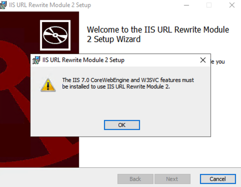
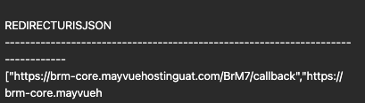

# url rewrite installation error

run this command in cmd prompt and try again

```powershell
Install-WindowsFeature Web-Server, Web-WebServer, Web-Common-Http, Web-Default-Doc, Web-Static-Content, Web-Http-Errors, Web-Asp-Net45, Web-Net-Ext45, Web-ISAPI-Ext, Web-ISAPI-Filter
```

# Application path not available

 run appplicationn table script

Replace all URLs with your actual DNS, if different.
```sql
    -- Newman
    UPDATE Application 
    SET PostLogoutRedirectUrisJson = '["https://brm-alpha-prod.mayvuehostingdev.com/BrM7/"]' 
    WHERE DisplayName = 'Newman';

    -- Serenity API
    UPDATE Application 
    SET PostLogoutRedirectUrisJson = '["https://brm-alpha-prod.mayvuehostingdev.com/BrM7/", "https://brm-alpha-prod.mayvuehostingdev.com/BrM7/signout-callback-oidc"]' 
    WHERE DisplayName = 'Serenity API';

    -- Serenity SPA
    UPDATE Application 
    SET PostLogoutRedirectUrisJson = '["https://brm-alpha-prod.mayvuehostingdev.com/BrM7/", "https://brm-alpha-prod.mayvuehostingdev.com/BrM7/signout-callback-oidc"]' 
    WHERE DisplayName = 'Serenity SPA';

    -- Swagger
    UPDATE Application 
    SET PostLogoutRedirectUrisJson = '["https://brm-alpha-prod.mayvuehostingdev.com/BrM7/"]' 
    WHERE DisplayName = 'Swagger';

    -- Newman
    UPDATE Application 
    SET RedirectUrisJson = '["https://brm-alpha-prod.mayvuehostingdev.com/BrM7/signin-oidc"]' 
    WHERE DisplayName = 'Newman';

    -- Serenity API
    UPDATE Application 
    SET RedirectUrisJson = '["https://brm-alpha-prod.mayvuehostingdev.com/BrM7/callback", "https://brm-alpha-prod.mayvuehostingdev.com/BrM7/silent-renew.html", "https://brm-alpha-prod.mayvuehostingdev.com/BrM7/api/oauth2-redirect.html"]' 
    WHERE DisplayName = 'Serenity API';

    -- Serenity SPA
    UPDATE Application 
    SET RedirectUrisJson = '["https://brm-alpha-prod.mayvuehostingdev.com/BrM7/callback", "https://brm-alpha-prod.mayvuehostingdev.com/BrM7/silent-renew.html", "https://brm-alpha-prod.mayvuehostingdev.com/BrM7/api/oauth2-redirect.html"]' 
    WHERE DisplayName = 'Serenity SPA';

    -- Swagger
    UPDATE Application 
    SET RedirectUrisJson = '["https://brm-alpha-prod.mayvuehostingdev.com/BrM7/api/oauth2-redirect.html"]' 
    WHERE DisplayName = 'Swagger';
```
## Application Path Showing #503 Page Not Available

If you encounter a **503 Service Unavailable** error, verify that the application configuration files are correctly set up.

Check the following configuration files:

- `C:\BrM7Websites\BrM7\appsettings.json`
- `C:\BrM7Websites\BrM7\wwwroot\app_config.json`
- `C:\BrM7Websites\TaskService\appsettings.json` 
Ensure the following values are correctly configured:
- Connection strings:
  - **Username**
  - **Password**
  - **Endpoint**
  - **Database name**
- Other application-specific settings (e.g., Authority URLs, API URIs, Redirect URIs)


## Root Application not available in the brownser
If the root application is not loading in the browser, follow these basic network troubleshooting steps:
### Test Internet & DNS Resolution
```powershell
ping google.com
nslookup google.com
```
Expected: Successful ping and resolved IP address.

### Check EC2's Public & Private IP
Use this to verify the network interface and assigned IPs.
```powershell
ipconfig
```
### Check Connectivity to Load Balancer
Replace your-load-balancer-dns-name with the actual Load Balancer DNS name:
```powershell
ping your-load-balancer-dns-name
nslookup your-load-balancer-dns-name
Test-NetConnection your-load-balancer-dns-name -Port 443
```
### Test DNS Resolution for Your App Domain
```powershell
nslookup your-app-domain.com
Test-NetConnection your-app-domain.com -Port 443
```

### Verify App Port Accessibility (from browser or CLI)
```powershell
notepad C:\Windows\System32\drivers\etc\hosts
```
### Confirm EC2 Security Group Rules
Ensure:
    Inbound rule allows TCP 443/80 from 0.0.0.0/0 (or your IP).
    Outbound is unrestricted or allows HTTPS.